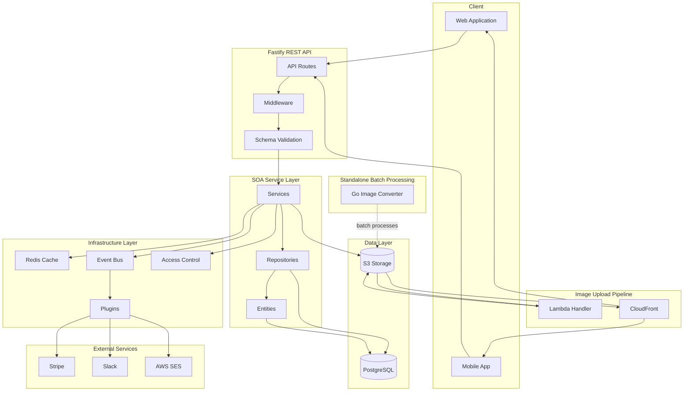
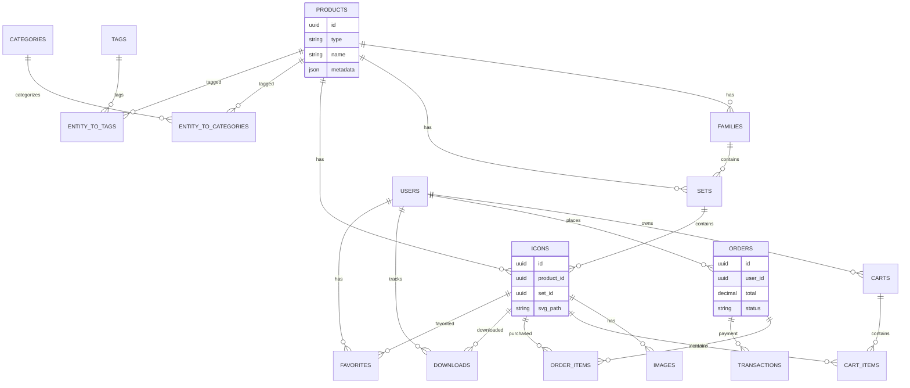
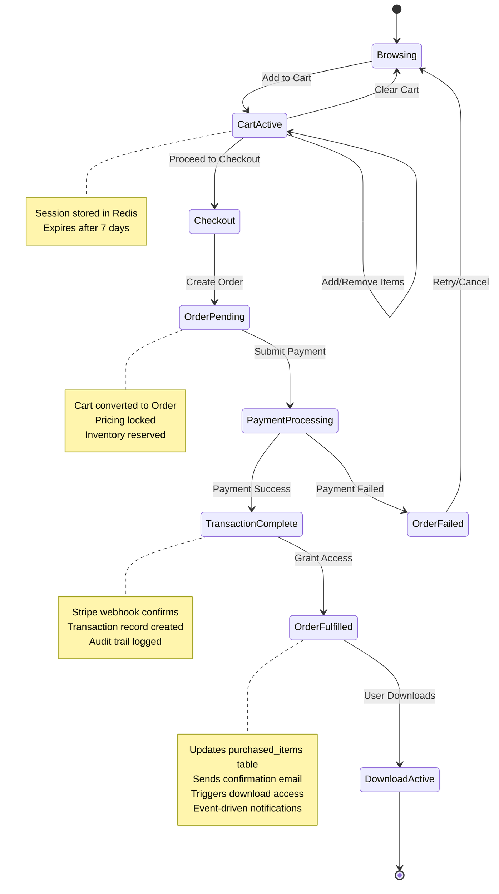
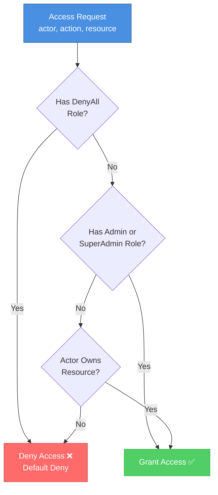

# VectorIcons - Icon Marketplace Backend Architecture

> **Portfolio Note:** This is a curated subset of the service-oriented architecture backend for VectorIcons, a multi-vendor marketplace for SVG icons & illustrations, shared for portfolio purposes. It is not runnable as-is due to removed infrastructure dependencies (authentication layers, payment processing, deployment configurations, and proprietary database connections). This repository demonstrates architecture, code quality, testing practices, and systems thinking.

## 📋 Table of Contents
- [System Overview](#system-overview)
- [Architecture Diagrams](#architecture-diagrams)
  - [System Architecture](#system-architecture)
  - [Database Schema](#database-schema)
  - [Image Processing Pipeline](#image-processing-pipeline)
  - [E-commerce Flow](#e-commerce-flow)
  - [Access Control Hierarchy](#access-control-hierarchy)
- [Core Modules](#core-modules)
  - [Product Catalog](#product-catalog)
  - [E-commerce Flow](#e-commerce-flow-1)
  - [Common Infrastructure](#common-infrastructure)
  - [AWS Integration](#aws-integration)
- [Testing Strategy](#testing-strategy)
- [Development Workflow](#development-workflow)
- [Technology Choices](#technology-choices)
- [Related Repositories](#related-repositories)
- [Code Highlights](#code-highlights)
- [What's Not Included](#whats-not-included)

---

## 🏗️ System Overview

VectorIcons is a production icon marketplace backend serving **750,000+ SVG icons**. This backend handles:

- **Product catalog** with hierarchical organization (families → sets → icons)
- **E-commerce flow** (cart → order → transaction → download)
- **Multi-format image processing** (SVG, PNG, WebP, PDF)
- **Event-driven plugin architecture** for extensibility
- **Role-based access control** (RBAC) with ownership checks
- **Distributed caching layer** with Redis

### Scale
- 750,000+ icon assets across multiple product families
- Millions of API requests per month
- Multi-region CDN delivery via CloudFront
- Real-time webhook processing (Stripe, Slack)
- Comprehensive test coverage (90%+)

---

## 📊 Architecture Diagrams

### System Architecture



### Database Schema



### Image Ingestion Pipeline

**Serverless event-driven architecture for contributor uploads**


**Key Components:**
- **ImageBatcher Lambda**: Extracts ZIP, creates product, queues image processing
- **ImageProcessor Lambda**: Generates WebP/PNG previews in multiple sizes per image
- **PreviewMaker Lambda**: Creates Family preview images after 120s delay
- **SQS Queues**: Decoupled async processing with delayed execution
- **Processing Time**: ~60 seconds (excluding 2-minute delay)

**Why the 120-second delay?**
The PreviewMaker waits for individual images to finish processing before generating Family previews from randomly selected images across all Sets in that Family.

### E-commerce Flow



### Access Control Hierarchy



---

## 🎯 Core Modules

### Product Catalog

**Location:** `src/products/`

Hierarchical product organization with polymorphic relationships demonstrating advanced data modeling:

- **Families** (`src/products/families/`) - Top-level collections (e.g., "Material Design Icons")
- **Sets** (`src/products/sets/`) - Thematic groupings (e.g., "Business Icons", "Social Media Icons")
- **Icons** (`src/products/icons/`) - Individual icon assets (750,000+ items)

**Key Architectural Features:**
- **Polymorphic tagging** - Categories and tags work across all product types using junction tables
- **Many-to-many relationships** - `entity-to-categories` and `entity-to-tags` provide flexible associations
- **Hierarchical queries** - Efficient traversal of family → set → icon relationships
- **JSON metadata storage** - Flexible schema for product attributes

**Design Pattern:** Service-Oriented Architecture (SOA)
- `Entity` - Data model with validation (Objection.js ORM)
- `Repository` - Database access layer with custom queries
- `Service` - Business logic layer

**Files:**
- Entity: `src/products/icons/IconEntity.js`
- Repository: `src/products/icons/IconRepository.js`
- Service: `src/products/icons/IconService.js`
- Tests: `src/products/icons/__tests__/` (integration + unit)

---

### E-commerce Flow

**Location:** `src/carts/`, `src/orders/`, `src/transactions/`

Implements a robust state machine for purchase processing:

```
Cart (session) → Order (confirmed) → Transaction (paid) → Downloads (delivered)
```

**Cart Management:**
- Redis-backed session storage with TTL
- Real-time item additions/removals
- Price calculation with discounts (business logic removed for portfolio)

**Order Processing:**
- Atomicity guaranteed via database transactions
- Immutable pricing snapshot (prevents price manipulation)
- Order items preserve purchase context

**Transaction Recording:**
- Audit trail for all payments
- Multi-payment method support
- Reconciliation with external payment processors

**Pattern:** Each step maintains referential integrity and complete audit trail

---

### Common Infrastructure

**Location:** `src/common/`

Reusable modules following Service-Oriented Architecture principles:

#### Access Control (`src/common/access-control/`)
**Role-Based Access Control (RBAC)** with hierarchical enforcement:

Priority order: `DenyAll → Admin/SuperAdmin → Resource Ownership → Default Deny`

```javascript
const allowed = await accessControl.enforce({
  actor: user,
  action: 'read',
  resource: icon
});
```

**Features:**
- Case-insensitive role matching
- String/number ID coercion for ownership checks
- Support for custom policy definitions
- Async enforcement for future policy expansion

**Tests:** 34 comprehensive tests covering role hierarchy and edge cases

---

#### Cache Layer (`src/common/cache/`)
**Adapter pattern** implementation with multiple strategies:

**Cache Modes:**
- `DEFAULT` - Normal cache behavior (read/write)
- `SKIP` - Bypass cache, hit database
- `BUST` - Clear cache and refresh
- `REFRESH` - Update cache with new data

**Features:**
- Entity rehydration (plain objects → Entity instances)
- Prefix-based invalidation
- TTL support
- Redis adapter included (easily swappable)

```javascript
const icons = await cache.get('icons:recent', {
  entityClass: IconEntity,
  mode: CacheMode.DEFAULT
});
```

---

#### Event Bus (`src/common/event-bus/`)
**Pub/sub pattern** for decoupled module communication:

**Features:**
- Multiple adapter support (Memory, Redis future)
- Built-in notifiers (Slack, Email)
- Error handling with notifications
- Event type registry for type safety

**Usage:**
```javascript
EventBus.on(EventTypes.USER_VERIFY_EMAIL, async (user) => {
  // Plugin logic here
});

EventBus.emit(EventTypes.ORDER_COMPLETED, order);
```

**Notifiers:**
- `SlackNotifier` - Posts errors to Slack channels
- `AdminEmailNotifier` - Sends critical alerts

---

#### Plugin System (`src/common/plugins/`)
**Event-driven extensions** that respond to EventBus events:

**Example Plugins:**
- `welcome-offer.js` - Sends coupon code when user verifies email
- `slack-user-signup.js` - Notifies team of new registrations
- `cancel-subscription-offer.js` - Re-engagement automation

**Pattern:** Plugins register event listeners and execute async workflows independently

---

### AWS Integration

**Location:** `src/aws/s3/`

**S3 Service** handles file operations with production-ready patterns:

**Features:**
- Streaming uploads/downloads (memory-efficient)
- Signed URL generation for secure access
- CloudFront integration
- Multi-part upload support (large files)
- Error handling and retry logic

**Related:** See [Go Image Converter](#related-repositories) for batch processing

---

## 🧪 Testing Strategy

**Coverage:** 90%+ across all modules

### Approach

**Contract-Based Testing** - Abstract base classes (BaseEntity, BaseRepository, BaseService) are validated through concrete implementations rather than direct testing. This ensures consistency across all 50+ modules.

**Separation of Concerns:**
- **Integration tests** (`*.test.js`) - Use real PostgreSQL database, no mocks
- **Unit tests** (`*.unit.test.js`) - Mock all dependencies

### Test Structure

```
src/products/icons/__tests__/
├── seed.js                    # Test data factories
├── entity.test.js             # Integration tests (real DB)
├── entity.unit.test.js        # Unit tests (mocked)
├── repository.test.js         # Custom query testing
├── repository.unit.test.js    # Query builder mocking
├── service.test.js            # Business logic integration
└── service.unit.test.js       # Service logic isolation
```

### Why Real Database for Integration Tests?

Using PostgreSQL in integration tests catches:
- Schema mismatches
- SQL query bugs
- Transaction handling issues
- Constraint violations
- Index performance problems

**Trade-off:** Slower tests, but higher confidence in production behavior.

### Run Tests

```bash
# Run all tests
npm test

# Run specific module
npm test src/products/icons/__tests__/

# Run only integration tests
npm test -- --testMatch="**/*.test.js"

# Run only unit tests
npm test -- --testMatch="**/*.unit.test.js"

# Coverage report
npm test -- --coverage
```

### Test Contracts

See `TEST-CONTRACTS.md` for standardized test patterns that all modules follow.

---

## 🤖 Development Workflow

This project was developed using **AI-assisted coding** with Claude Code (Anthropic).

### Process Artifacts Included

- **`AGENTS.md`** - Agent configuration, prompts, and interaction patterns
- **`TEST-STRATEGY.md`** - Testing philosophy and approach documentation
- **`TEST-CONTRACTS.md`** - Standardized test patterns for SOA modules
- **`tasks/*.md`** - 73 individual module test plans with estimates
- **`tests-checklist.md`** - Progress tracking across all modules

### Workflow Steps

1. **Create feature branch** (never work on main/develop)
2. **Write task plan** - Estimate time, list test cases, identify dependencies
3. **Get approval** - Review plan before implementation
4. **Implement with AI assistance** - Iterative development with Claude
5. **Comprehensive testing** - Both integration and unit tests
6. **Code review** - Human review of AI-generated code
7. **PR and merge** - Maintain clean git history

### Why Share This?

Including AI-assisted development artifacts demonstrates:

✅ **Modern development practices** - Leveraging AI as a force multiplier
✅ **Prompt engineering skills** - Effective communication with AI systems
✅ **Process documentation** - Clear, repeatable workflows
✅ **Quality control** - Human oversight of AI outputs
✅ **Planning discipline** - Thoughtful task breakdown before coding

**Philosophy:** AI should augment, not replace, engineering judgment. All code was reviewed, tested, and refined by human engineers.

---

## 🛠️ Technology Choices

| Technology | Purpose | Rationale |
|------------|---------|-----------|
| **Node.js** | API backend | Event-driven I/O ideal for web APIs, rich ecosystem |
| **Fastify** | Web framework | Faster than Express, built-in schema validation |
| **PostgreSQL** | Primary database | Complex relationships, ACID compliance, JSON support |
| **Objection.js** | ORM | SQL-friendly (not hiding SQL), relation graphs |
| **Redis** | Caching layer | Sub-millisecond lookups, TTL support, pub/sub |
| **Jest** | Testing | Industry standard, excellent async support, built-in mocks |
| **Go** | Batch processing | Goroutines for CPU-intensive parallel work (750k files) |
| **AWS S3** | Object storage | Scalable, durable, CDN integration |
| **AWS CDK** | Infrastructure | Type-safe IaC, full AWS service coverage, CloudFormation |

### Polyglot Approach

**Node.js for I/O-bound work:**
- API request handling
- Database queries
- Event-driven workflows
- Real-time websockets (not in portfolio)

**Go for CPU-bound work:**
- Image format conversion (SVG → WebP/PNG/PDF)
- Parallel processing of 750,000 files
- Goroutines provide excellent concurrency

**Philosophy:** Choose the right tool for the job, not the most familiar tool.

---

## 🔗 Related Repositories

This portfolio represents one component of the complete VectorIcons platform:

### 1. **Backend API** (This Repository)
Node.js/Fastify backend with SOA architecture

**Demonstrates:**
- Backend API development
- Database design and optimization
- Testing practices and coverage
- Event-driven architecture

### 2. **Infrastructure Stacks** (Separate Repository)
AWS CDK definitions across 15 CloudFormation stacks

**Includes:**
- VPC and networking
- RDS PostgreSQL cluster
- S3 buckets with lifecycle policies
- CloudFront distributions
- Lambda functions
- SQS queues and SNS topics
- WAF rules and security policies

**Demonstrates:**
- Infrastructure as Code (IaC)
- AWS service orchestration
- Multi-environment deployments
- Security best practices

### 3. **Go Image Converter** (Separate Repository)
Post-launch migration tool for WebP format conversion

**The Problem:**
After launching VectorIcons with 500,000+ SVG images, we realized WebP versions were missing - a critical optimization for web performance. Rather than re-upload everything, I built a CLI tool to batch-convert existing images.

**Solution - CLI Workflow:**
1. Download SVG from S3
2. Convert SVG → PNG
3. Apply watermark (optional)
4. Convert PNG → WebP
5. Upload WebP to S3
6. Update database metadata
7. Clean up temporary files
8. Repeat 500,000 times

**Technical Implementation:**
- **Goroutine worker pools** for concurrent processing
- **Multi-threaded S3 operations** (download/upload in parallel)
- **Batch database updates** to minimize connection overhead
- **Progress tracking and resume capability** for long-running jobs
- **Error handling and retry logic** for network failures

**Results:**
- Processed 500,000+ images
- Reduced page load times significantly with WebP
- Completed migration without service interruption

**Demonstrates:**
- Problem-solving under pressure (post-launch fix)
- Go programming and concurrency patterns
- Large-scale data migration strategies
- AWS S3 integration at scale
- Performance optimization mindset

### Complete Platform Architecture

```
Frontend (React/Next.js)
    ↓
Backend API (This Repo - Node.js)
    ↓
Infrastructure (CDK Stacks - TypeScript)
    ↓
Batch Processing (Go Converter)
```

**Together, these demonstrate:**
- Full-stack ownership
- Polyglot engineering
- Cloud-native architecture
- DevOps/IaC practices

---

## 📝 Code Highlights

### Service-Oriented Architecture Pattern

All domain modules follow this consistent pattern:

```javascript
// Entity - Data model with validation
class IconEntity extends BaseEntity {
  static get tableName() {
    return 'icons';
  }

  static get jsonSchema() {
    return {
      type: 'object',
      required: ['name', 'svg_path'],
      properties: {
        name: { type: 'string', minLength: 1, maxLength: 255 },
        svg_path: { type: 'string' }
      }
    };
  }
}

// Repository - Database access
class IconRepository extends BaseRepository {
  async findBySetId(setId) {
    return this.model
      .query()
      .where('set_id', setId)
      .orderBy('name');
  }
}

// Service - Business logic
class IconService extends BaseService {
  async getIconsInSet(setId) {
    const icons = await this.repository.findBySetId(setId);
    return icons.map(icon => icon.toJSON());
  }
}
```

**Benefits:**
- Consistent patterns across 50+ modules
- Clear separation of concerns
- Easily testable (mock at boundaries)
- Scalable team development

---

### Event-Driven Plugin Example

```javascript
// welcome-offer.js
const { EventBus, EventTypes } = require('../event-bus');
const mailService = require('../mail-service');
const { initCouponCodeService } = require('../../coupon-codes');

EventBus.on(EventTypes.USER_VERIFY_EMAIL, async (user) => {
  try {
    const couponService = initCouponCodeService();
    const coupon = await couponService.createRandom({
      userId: user.id,
      amount: 10,
      expiresIn: '30 days'
    });

    await mailService.maybeSendAutoResponder({
      type: 'welcome-offer',
      user,
      data: {
        coupon_code: coupon.code,
        amount: coupon.amount
      }
    });
  } catch (error) {
    // Error notification omitted for portfolio
    console.error('Failed to send welcome offer', error);
  }
});
```

**Pattern:** Plugins are self-contained, event-driven, and fail gracefully.

---

### Cache Rehydration Pattern

```javascript
// Retrieve cached data and rehydrate into Entity instances
const icons = await cacheService.get('icons:featured', {
  entityClass: IconEntity,
  ttl: 3600,
  mode: CacheMode.DEFAULT,
  fetchFn: async () => {
    return iconService.getFeaturedIcons();
  }
});

// Returns: IconEntity[] (not plain objects)
// Allows: icons[0].someEntityMethod()
```

**Benefit:** Cached data behaves identically to fresh DB queries.

---

## 🔒 What's Not Included

For security and proprietary reasons, the following are excluded from this portfolio:

### Security-Sensitive
- ❌ **Authentication implementation** - JWT generation, password hashing, session management, rate limiting
- ❌ **Password reset flows** - Token generation and validation
- ❌ **Login history** - Security audit trails

### Business Logic
- ❌ **Payment processing details** - Stripe webhook handlers, refund logic
- ❌ **Pricing calculations** - Discount algorithms, promotional pricing
- ❌ **Revenue reporting** - Financial analytics and dashboards

### Infrastructure
- ❌ **Production secrets** - API keys, database credentials, signing keys
- ❌ **Deployment scripts** - CI/CD pipelines, deployment automation
- ❌ **Environment configurations** - Production, staging, development configs
- ❌ **Monitoring setup** - Datadog, Sentry, CloudWatch configurations

### Dependencies
- ❌ **Proprietary packages** - Internal libraries and shared utilities
- ❌ **Database migrations** - Full schema evolution history

**Note:** I have extensive experience in all these areas and can discuss implementations in interviews without sharing proprietary code.

---

## 📧 Contact & Links

**Developer:** Scott Russell

**LinkedIn:** [Your LinkedIn URL]
**GitHub:** [Your GitHub Profile]
**Email:** [Your Email]

**Looking for:** Senior Backend Engineer / Staff Engineer roles focusing on Node.js, distributed systems, and cloud architecture

---

## 🚀 Quick Start (For Review)

While this repository is not runnable without the full infrastructure, you can:

### Browse the Code
```bash
git clone https://github.com/yourusername/vectoricons-portfolio.git
cd vectoricons-portfolio
```

### Explore Key Files
- Architecture: `README.md` (this file)
- Testing approach: `TEST-STRATEGY.md`
- AI workflow: `AGENTS.md`
- Example module: `src/products/icons/`
- Example tests: `src/common/access-control/__tests__/`

### Review Development Process
- Task planning: `tasks/icons-tests.md`
- Progress tracking: `tests-checklist.md`
- Test contracts: `TEST-CONTRACTS.md`

---

**Questions?** Feel free to reach out for a detailed discussion about any architectural decisions, design patterns, or implementation details.

---

*This portfolio demonstrates production-grade backend engineering with a focus on scalability, maintainability, and comprehensive testing. All code has been written and reviewed by experienced engineers, with AI assistance used to accelerate development while maintaining high quality standards.*
