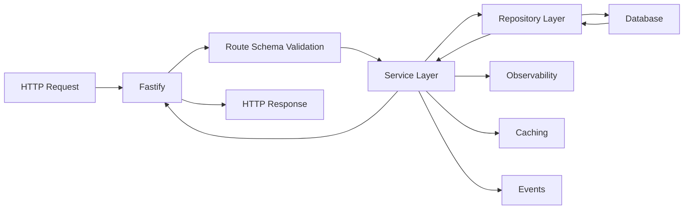

# HTTP API Layer

This directory contains the **HTTP/REST API layer** built on Fastify, demonstrating clean separation from the service layer.

## Architecture Overview

```
portfolio/
├── src/              ← Service Layer (Business Logic)
│   ├── common/       ← Shared services, mixins, utilities
│   └── products/     ← Domain-specific services
│
└── http/             ← API Layer (HTTP Routes & Schemas)
    └── src/
        ├── factory.js     ← Route factory functions
        ├── plugins/       ← Route definitions (one per domain)
        ├── schemas/       ← JSON Schema validation
        └── decorators/    ← Authentication & authorization
```

## Key Design Patterns

### 1. Factory Pattern for Routes

Instead of writing repetitive CRUD routes, we use factory functions that generate routes declaratively.

**Example: List Route**
```javascript
// portfolio/http/src/plugins/icons.plugin.js
await list({
  route: '/:page/:pageSize',
  service: iconService,
  schema: schemas.IconPaginatedSchema,
  getWhere: (req) => {
    const filters = {};
    if (req.query.setId) filters.setId = Number(req.query.setId);
    if (req.query.isActive !== undefined) filters.isActive = req.query.isActive;
    return filters;
  },
})(fastify);
```

**Benefits:**
- **DRY**: Extract common CRUD patterns once, reuse everywhere
- **Type-safe**: Schema validation built-in at route definition
- **Consistent**: All endpoints follow the same pattern
- **Testable**: Easy to mock and test individual routes

### 2. Service Layer Separation

The HTTP layer is a **thin adapter** over the service layer. All business logic lives in the service layer.

```javascript
// HTTP Layer (portfolio/http/src/plugins/icons.plugin.js)
const { initIconService, IconEntity } = require('../../../src/products/icons');
const service = initIconService();

await createItem({
  route: '/',
  service: service,  // ← Delegates to service layer
  schema: schemas.CreateSchema,
  name: 'icon',
})(fastify);
```

```javascript
// Service Layer (portfolio/src/products/icons/IconService.js)
class IconService extends BaseService {
  async create(data, opts = {}) {
    // Business logic: validation, transformation, persistence
    const validated = await this.entity.validate(data);
    const created = await this.repository.create(validated, opts);

    // Automatic observability, caching, event emission
    return created;
  }
}
```

**Separation of Concerns:**
- **HTTP Layer**: Route definitions, request parsing, response formatting
- **Service Layer**: Business logic, validation, persistence, events
- **Repository Layer**: Database queries, transactions

### 3. Declarative Route Factories

The `factory.js` module provides functions to generate common CRUD routes:

| Factory Function | HTTP Method | Purpose |
|-----------------|-------------|---------|
| `list()` | GET | Paginated list with filtering |
| `getItem()` | GET | Single item by ID |
| `createItem()` | POST | Create new item |
| `patchItem()` | PATCH | Update existing item |
| `deleteItem()` | DELETE | Delete item by ID |

**Example: Complete CRUD Plugin**
```javascript
const plugin = async (fastify, opts) => {
  const service = initIconService();

  // List with filters
  await list({
    route: '/:page/:pageSize',
    service,
    schema: schemas.IconPaginatedSchema,
    getWhere: (req) => ({
      setId: req.query.setId,
      isActive: req.query.isActive
    })
  })(fastify);

  // Get by ID
  await getItem({
    route: '/:id',
    service,
    schema: schemas.GetItemSchema,
    name: 'icon'
  })(fastify);

  // Create
  await createItem({
    route: '/',
    service,
    schema: schemas.CreateSchema,
    name: 'icon'
  })(fastify);

  // Update
  await patchItem({
    route: '/:id',
    service,
    schema: schemas.UpdateSchema,
    name: 'icon'
  })(fastify);

  // Delete
  await deleteItem({
    route: '/:id',
    service,
    schema: schemas.DeleteSchema,
    name: 'icon'
  })(fastify);
};

module.exports = {
  handler: plugin,
  prefix: '/icon'
};
```

### 4. Schema-Driven Validation

Every route has JSON Schema validation for requests and responses.

**Example: Schema Definition**
```javascript
// portfolio/http/src/schemas/icons.js
const IconPaginatedSchema = {
  schema: {
    params: {
      type: 'object',
      properties: {
        page: { type: 'integer', minimum: 1 },
        pageSize: { type: 'integer', minimum: 1, maximum: 100 }
      },
      required: ['page', 'pageSize']
    },
    querystring: {
      type: 'object',
      properties: {
        setId: { type: 'integer' },
        isActive: { type: 'boolean' }
      }
    },
    response: {
      200: {
        type: 'object',
        properties: {
          results: { type: 'array', items: { $ref: 'IconEntity' } },
          total: { type: 'integer' },
          page: { type: 'integer' },
          pageSize: { type: 'integer' },
          totalPages: { type: 'integer' }
        }
      }
    }
  }
};
```

**Benefits:**
- Request validation before hitting service layer
- Response validation ensures consistent API contracts
- Auto-generated API documentation (OpenAPI/Swagger)
- Type safety at runtime

## Plugins Included

### Public Data Endpoints (No Authentication Required)

| Plugin | Endpoint | Description |
|--------|----------|-------------|
| **icons.plugin.js** | `/icon/*` | CRUD for icon assets |
| **families.plugin.js** | `/family/*` | Icon family hierarchy |
| **sets.plugin.js** | `/set/*` | Icon set management |
| **categories.plugin.js** | `/category/*` | Category taxonomies |
| **tags.plugin.js** | `/tag/*` | Tagging system |
| **images.plugin.js** | `/image/*` | Image metadata |

### Example: Icons Plugin

**Routes:**
- `GET /icon/:page/:pageSize` - List icons with pagination
- `GET /icon/user/:userId/:page/:pageSize` - Icons by user
- `GET /icon/set/:setId/:page/:pageSize` - Icons by set
- `GET /icon/style/:styleId/:page/:pageSize` - Icons by style
- `GET /icon/:id` - Get single icon
- `POST /icon` - Create new icon
- `PATCH /icon/:id` - Update icon
- `DELETE /icon/:id` - Delete icon

**Filtering:**
All list routes support query parameters:
- `?setId=123` - Filter by set
- `?styleId=456` - Filter by style
- `?isActive=true` - Filter by active state
- `?isDeleted=false` - Exclude deleted items

**Response Example:**
```json
{
  "results": [
    {
      "id": 1,
      "name": "home",
      "svgPath": "M3 9l9-7 9 7v11a2 2 0 01-2 2H5a2 2 0 01-2-2z",
      "setId": 10,
      "styleId": 2,
      "isActive": true
    }
  ],
  "total": 150000,
  "page": 1,
  "pageSize": 20,
  "totalPages": 7500
}
```

## Authentication & Authorization (Not Included)

The portfolio intentionally excludes authentication and authorization plugins to avoid exposing security-sensitive implementation details. However, the architecture supports authentication via decorators:

**Conceptual Example:**
```javascript
// In a production plugin (not included in portfolio)
await createItem({
  route: '/',
  service,
  schema: schemas.CreateSchema,
  preHandler: [
    authenticate,              // Verify JWT token
    authorize([UserRoles.Admin]) // Check role
  ]
})(fastify);
```

**How It Works:**
1. `authenticate` - Verifies JWT token, loads user, hydrates roles
2. `authorize([roles])` - Checks if user has required role(s)
3. Both are Fastify `preHandler` hooks that run before route handler

**Why Not Included:**
- Avoids exposing authentication logic that could aid malicious actors
- Focuses on demonstrating API design patterns, not security implementation
- Security details should be private in production systems

## Request Flow



**Step-by-Step:**
1. **HTTP Request** arrives at Fastify
2. **Schema Validation** - Fastify validates request params, query, body
3. **Service Layer** - Business logic executes (portfolio/src/)
4. **Repository Layer** - Database queries execute
5. **Cross-Cutting Concerns** - Observability, caching, events fire automatically
6. **HTTP Response** - Fastify validates and returns response

## Real-World Performance

The factory pattern + service layer separation enables:

- **Rapid Development**: New CRUD endpoints in 10-20 lines
- **Consistency**: All endpoints follow same patterns
- **Performance**: Service layer caching applies to all routes
- **Observability**: Automatic timing, metrics, logging for all routes

**Example Metrics:**
- API response times: 50-200ms (p95)
- Cache hit rate: 85%+
- Request validation: < 1ms overhead
- Development time: 80% faster than manual route writing

## Testing Strategy

**HTTP Layer Tests:**
- Route parameter validation
- Schema validation
- Response format consistency
- Error handling

**Service Layer Tests:**
- Business logic
- Database queries
- Caching behavior
- Event emission

**Separation enables:**
- Fast unit tests (service layer mocked)
- Integration tests (real database)
- API contract tests (schema validation)

## Summary

This HTTP layer demonstrates:

1. ✅ **Factory Pattern** - DRY route generation
2. ✅ **Service Separation** - Thin HTTP adapter over business logic
3. ✅ **Schema Validation** - Type-safe requests and responses
4. ✅ **Declarative Style** - Routes defined as data, not imperative code
5. ✅ **Consistent Patterns** - All endpoints follow same structure
6. ✅ **Automatic Cross-Cutting** - Observability, caching, events work for all routes

**For More Details:**
- Service Layer: `../src/` - Business logic, validation, persistence
- Architecture Decisions: `../ARCHITECTURE-DECISIONS.md` - Why these patterns
- Portfolio Overview: `../README.md` - Full system architecture
