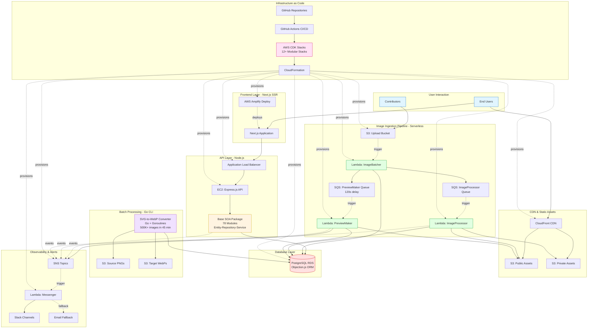
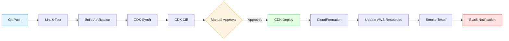

# VectorIcons.net Ecosystem Architecture

**Overview:** A production multi-vendor marketplace for vector icons and illustrations, built as a distributed system across multiple specialized services.

---

## System Architecture



---

## Component Overview

### 1. Base SOA Package (Node.js)
**Repository:** This repo
**Technology:** Node.js, Express.js, PostgreSQL, Objection.js

**Architecture:**
- Service-Oriented Architecture with 78 modules
- Entity-Repository-Service pattern
- Event-driven with pluggable architecture
- Mixin pattern for capability composition
- Contract-based testing (90%+ coverage)

**Key Features:**
- Modular design enables focused development
- Clear layer boundaries (Entity → Repository → Service → HTTP)
- Immutable entities with Object.freeze()
- Event bus for observability and decoupling
- Comprehensive test contracts for consistency

**Portfolio Showcase:**
- Systems thinking and architectural decisions
- Clean code patterns and SOLID principles
- AI-augmented development (clear patterns enable effective AI collaboration)
- Production-ready with comprehensive testing

---

### 2. Image Ingestion Pipeline (Serverless)
**Repository:** Separate repo (AWS Lambda)
**Technology:** AWS Lambda, S3, SQS, SNS, Node.js

**Architecture:**
```
ZIP Upload → ImageBatcher Lambda → SQS Fan-out → ImageProcessor Lambda
                ↓                                          ↓
          Create Set in DB                    Process images (WebP, PNG)
                ↓                                          ↓
    Delayed SQS → PreviewMaker Lambda              Update DB
                        ↓
              Generate Family Preview
```

**Performance:**
- Sub-1-minute processing (excluding 2-minute preview delay)
- Fan-out pattern: 1 ZIP → N individual image jobs
- Asynchronous, non-blocking user experience
- Multiple formats (WebP, PNG) and sizes (128px, 512px)

**Key Features:**
- Event-driven serverless architecture
- S3 triggers → Lambda → SQS queues
- Delayed queue for dependent processing
- Composite image generation for previews
- SNS notifications for completion

**Portfolio Showcase:**
- Event-driven patterns at scale
- AWS serverless expertise
- Async workflow orchestration
- Fan-out processing patterns

---

### 3. SVG-to-WebP Batch Converter (Go CLI)
**Repository:** Separate repo (Go application)
**Technology:** Go 1.22, AWS S3, PostgreSQL, GORM

**Performance Achievement:**
- **500,000+ images processed in 45 minutes**
- **16x speedup** over single-threaded execution
- Initial estimates (Node.js): 11.5 days
- Concurrent Go implementation: 45 minutes

**Architecture:**
- Dual worker pool pattern (download + process workers)
- Producer-consumer with buffered channels
- Goroutines for lightweight concurrency
- Strategy pattern for local/S3 storage abstraction

**Processing Pipeline:**
```
SVG → PNG (rsvg-convert)
  → Optional Watermark (ffmpeg)
  → WebP Conversion (ffmpeg -q:v 75)
  → S3 Upload
```

**Concurrency Model:**
- Configurable worker pools (5 download, 10 process)
- Buffered channels for work distribution
- WaitGroups for synchronization
- Prevents resource exhaustion

**Portfolio Showcase:**
- Performance engineering and optimization
- Go concurrency patterns (goroutines, channels)
- Producer-consumer architecture
- 16x measurable improvement
- Real production problem solved at scale

---

### 4. AWS Infrastructure (CDK Stacks)
**Repository:** Separate repo (Infrastructure as Code)
**Technology:** AWS CDK (JavaScript), CloudFormation

**Modular Stack Architecture:**

**Networking & Security:**
- VpcStack - Isolated networking with public/private subnets
- IamStack - Role/policy management with least privilege

**Compute & Storage:**
- ApiServerStack (EC2) - Express.js API server
- RdsStack - PostgreSQL database cluster
- S3Stack - Purpose-specific buckets (uploads, assets, CDN)
- LambdaLayersStack - Shared dependencies (sharp, aws-sdk)

**Application Delivery:**
- AlbStack - Application Load Balancer
- CloudFrontStack - CDN with cache behaviors
- AmplifyStack - Next.js SSR frontend deployment
- Route53Stack - DNS with explicit A/AAAA/CNAME records

**Event-Driven Services:**
- UploadsStack (ImageEngine) - S3 → SQS → Lambda pipeline
- MessengerStack - SNS → Slack notifications with email fallback

**Key Principles:**
- No stack owns another's resources (explicit imports only)
- No auto-generated names (explicit constants)
- No wildcard permissions (scoped IAM)
- No manual post-deploy configuration (fully codified)
- Security and testability as first-class citizens

**Portfolio Showcase:**
- Infrastructure as Code expertise
- AWS cloud architecture
- Modular, reusable stack patterns
- Security best practices (least privilege)
- Production-grade deployment automation

---

## CI/CD Pipeline

### GitHub Actions Workflow



**Deployment Flow:**
1. **Code pushed** to GitHub (develop or main branch)
2. **CI runs:** Linting, tests, build validation
3. **CDK synthesizes** CloudFormation templates
4. **Diff review:** Shows infrastructure changes
5. **Manual approval** required for production
6. **CDK deploys** to AWS via CloudFormation
7. **Smoke tests** verify deployment
8. **Slack notification** confirms success/failure

**Environments:**
- Development: Auto-deploy on `develop` branch
- Production: Manual approval required for `main` branch

---

## Data Flow Examples

### Contributor Upload Flow

```
1. Contributor uploads ZIP to S3 (via signed URL)
2. S3 triggers ImageBatcher Lambda
3. ImageBatcher:
   - Extracts ZIP + manifest.json
   - Creates Set record in PostgreSQL
   - Enqueues N image jobs to SQS (ImageProcessor queue)
   - Enqueues 1 delayed job to SQS (PreviewMaker queue, 120s)
4. ImageProcessor Lambda (N concurrent executions):
   - Converts SVG → PNG → WebP
   - Generates multiple sizes (128px, 512px)
   - Uploads to S3 (public/private buckets)
   - Inserts image + product records in DB
5. PreviewMaker Lambda (after 120s delay):
   - Queries all images in Family
   - Randomly selects subset
   - Generates composite preview image
   - Updates Family preview in DB
   - Sends SNS notification
6. User sees completed product in UI (~1 minute total)
```

### Batch Conversion Flow (Retroactive WebP Generation)

```
1. Run Go CLI: ./image-processor --prefix=contributor --config=config.yaml
2. Assumes IAM role via AWS STS
3. Lists 500K+ PNG files from S3
4. Download workers (5 goroutines):
   - Fetch files from S3
   - Add to process queue
5. Process workers (10 goroutines):
   - Convert PNG → WebP (ffmpeg)
   - Apply watermarks (if needed)
   - Upload WebP to S3 target bucket
6. Complete in 45 minutes (16x faster than single-threaded)
```

---

## Key Architectural Decisions

### Why Service-Oriented Architecture?
- **Modularity:** 78 modules with clear boundaries
- **Testing:** Independent testing per layer
- **AI-Augmented Development:** Clear patterns enable effective AI collaboration
- **Scalability:** Easy to add new modules following established pattern

### Why Event-Driven Pipeline?
- **Decoupling:** S3 → SQS → Lambda = independent scaling
- **Async Processing:** Non-blocking user experience
- **Fault Tolerance:** SQS retries on failure
- **Fan-out:** Process N images concurrently from 1 upload

### Why Go for Batch Processing?
- **Performance:** 16x faster than single-threaded (45 min vs 11.5 days estimated)
- **Concurrency:** Lightweight goroutines, minimal overhead
- **Type Safety:** Compile-time guarantees for production workload
- **Native Tooling:** Built-in profiling, benchmarking

### Why CDK for Infrastructure?
- **Type Safety:** JavaScript with full IDE support
- **Modularity:** Stack-per-concern, explicit imports
- **Version Control:** Infrastructure changes tracked in Git
- **Testability:** Snapshot tests for CloudFormation templates

---

## Scale & Performance Metrics

### Production Stats
- **750,000+** vector assets managed
- **500,000+** images batch-converted (45 minutes)
- **Sub-1-minute** upload processing (excluding preview delay)
- **14M+** database records
- **Millions** of API requests per month

### Performance Achievements
- **16x speedup** (Go batch converter vs single-threaded)
- **99.9%** uptime target (circuit breakers, fallbacks)
- **Sub-200ms** API response time (p95 target)
- **Serverless scaling** (Lambda auto-scales to demand)

---

## Technology Stack Summary

| Layer | Technology | Purpose |
|-------|-----------|---------|
| **Frontend** | Next.js, React, AWS Amplify | SSR, SEO, user interface |
| **API** | Node.js, Express.js, EC2 | REST API, business logic |
| **Database** | PostgreSQL, Objection.js | Relational data, ORM |
| **SOA Layer** | Entity-Repository-Service | Domain logic, data access |
| **Image Pipeline** | AWS Lambda, S3, SQS, SNS | Serverless async processing |
| **Batch Processing** | Go, goroutines, channels | High-performance conversion |
| **CDN** | CloudFront, S3 | Static asset delivery |
| **Infrastructure** | AWS CDK, CloudFormation | IaC, provisioning |
| **Observability** | SNS, Slack, EventBus | Notifications, audit trail |
| **CI/CD** | GitHub Actions, CDK | Deployment automation |

---

## Portfolio Value Proposition

This ecosystem demonstrates **Staff/Principal Engineer capabilities**:

### Systems Thinking
- Designed complete multi-service architecture
- Chose appropriate technology for each problem domain
- Event-driven patterns across multiple services

### Performance Engineering
- Measurable optimization: 16x speedup (45 min vs 11.5 days)
- Concurrent processing with Go goroutines
- Serverless scaling for variable workloads

### Cloud Native Architecture
- Infrastructure as Code with modular CDK stacks
- Event-driven serverless patterns (S3 → SQS → Lambda)
- Multi-region considerations with CloudFront CDN

### Production Maturity
- Comprehensive testing (90%+ coverage, contract-based)
- Observability built-in (event bus, SNS notifications)
- Error handling and fallbacks (circuit breakers, Slack → email)
- Security best practices (scoped IAM, least privilege)

### Technical Leadership
- Architectural Decision Records document trade-offs
- Clear patterns enable team scaling (or AI-augmented solo development)
- Modular design supports independent development streams

---

## Repository Structure

```
vectopus-org/
├── base/                      # This repo - SOA package
│   ├── src/                   # 78 SOA modules
│   ├── docs/                  # Architecture docs
│   └── tests/                 # Contract-based tests
│
├── image-ingestion/           # Serverless pipeline
│   ├── lambdas/
│   │   ├── ImageBatcher/
│   │   ├── ImageProcessor/
│   │   └── PreviewMaker/
│   └── infrastructure/        # CDK stack
│
├── svg-to-webp/              # Go batch converter
│   ├── src/
│   │   ├── image-processor/
│   │   ├── file-service/
│   │   └── database/
│   └── README.md             # Performance docs
│
└── infrastructure/            # AWS CDK stacks
    ├── vpc/
    ├── iam/
    ├── rds/
    ├── uploads/
    ├── messenger/
    └── [8 more stacks]
```

---

**Last Updated:** 2025-10-17
